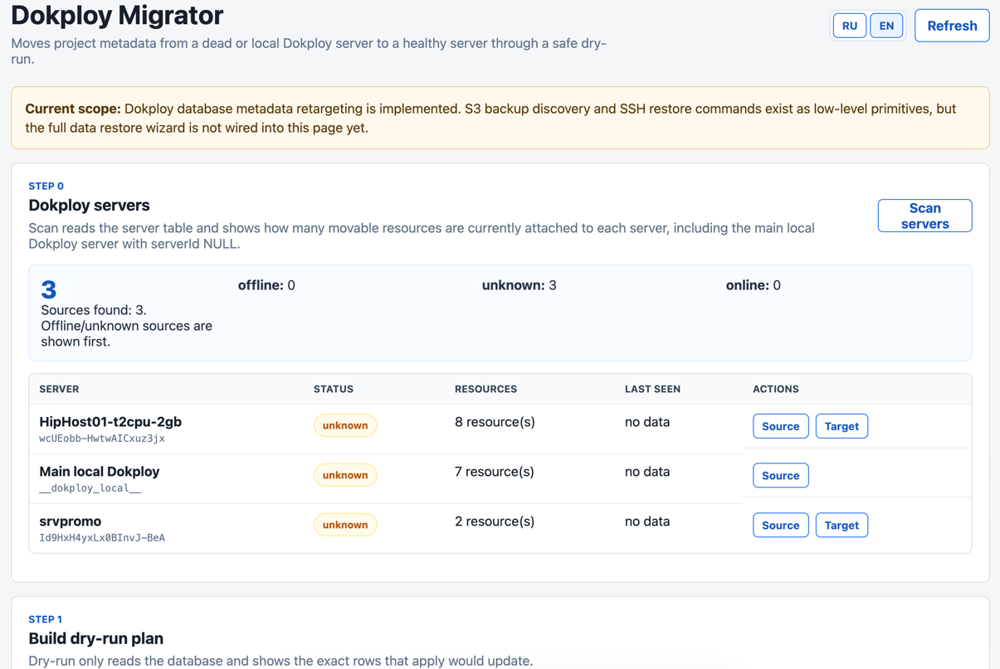

# Dokploy Migrator

Dokploy Migrator is a small recovery tool for Dokploy operators. It helps move Applications, Compose stacks, databases, and domains away from a dead Dokploy server by retargeting Dokploy database metadata after a reviewed dry-run.

The app is designed to run as a normal Docker Compose application in Dokploy.



## Project Status

Dokploy Migrator is pre-stable. The current production scope is metadata retargeting for recovery from a dead Dokploy server. S3 backup discovery and SSH restore command primitives exist in the codebase, but the full data restore wizard is not implemented yet.

There are no stable releases yet. For production use after the first release, pin a versioned container image instead of relying on a moving branch or `latest`.

## Best Fit

Use Dokploy Migrator when the failed step is Dokploy metadata still pointing resources at an unavailable server and the affected resources can be redeployed after a reviewed `serverId` retarget. It is easiest to reason about in single-host or non-Swarm application recovery paths for Applications, Compose stacks, and Dokploy-managed databases.

In Docker Swarm environments, treat this as a database-level recovery helper only. Swarm keeps separate manager, service, task, network, volume, and routing state; Dokploy Migrator does not move Swarm services, reschedule tasks, migrate volumes, or repair overlay networks. After any metadata retarget, verify and redeploy the affected resources in Dokploy and inspect Docker/Swarm state manually.

## What It Does Today

- Scans Dokploy servers from the connected PostgreSQL database.
- Shows server IDs, best-effort status, last activity, and attached resource counts.
- Builds a dry-run migration plan for `source serverId -> target serverId`, including the built-in local Dokploy source where resources have `serverId = NULL`.
- Applies metadata retargeting only after explicit operator confirmation.
- Keeps paginated job history and reports in a separate SQLite database; the latest 50 jobs are protected from deletion.
- Provides rollback through the API/CLI for deliberate operator use with the same schema approval boundary.

## What It Does Not Do

- Does not move running containers, Docker services, Swarm tasks, Docker networks, or Docker volumes.
- Does not replace a PostgreSQL backup or a real data restore plan.
- Does not automatically redeploy Dokploy resources after the metadata change.
- Does not implement the full S3 volume/database restore wizard yet.

## Safety Model

- The UI and API require HTTP Basic Auth.
- Mutating endpoints also require `MIGRATOR_ADMIN_TOKEN`.
- Apply requires a dry-run plan, `schemaHash` approval, and typed `APPLY`.
- Rollback requires the reviewed dry-run plan and the same `schemaHash` approval boundary.
- If the UI/API schema hash field is empty, writes fall back to `MIGRATOR_SCHEMA_ALLOWLIST`.
- Writes are executed in one PostgreSQL transaction.
- The adapter validates schema drift, table allowlists, ID columns, and affected row counts.

Do not expose this app without strong Basic Auth credentials.

## Quick Start in Dokploy

Deploy this repository as a Docker Compose app and set:

```sh
MIGRATOR_BASIC_USER=admin
MIGRATOR_BASIC_PASSWORD=<strong-basic-auth-password>
MIGRATOR_ADMIN_TOKEN=<strong-admin-token>
DOKPLOY_POSTGRES_DSN=postgres://dokploy:<postgres-password>@dokploy-postgres:5432/dokploy?sslmode=disable
MIGRATOR_HTTP_PORT=8080
```

In Dokploy Domains, keep `Container Port` set to `8080`.

`MIGRATOR_HTTP_PORT` controls only the optional host-published port. The app always listens inside the container on `8080`.

The container refuses to start without Basic Auth credentials and an admin token.

Health check:

```sh
curl -fsS -u "$MIGRATOR_BASIC_USER:$MIGRATOR_BASIC_PASSWORD" http://127.0.0.1:8080/api/health
```

Expected:

```json
{"status":"ok"}
```

## UI Flow

1. Open the Migrator URL and log in with Basic Auth.
2. Click `Сканировать серверы` / `Scan servers`.
3. Pick the dead source server, or pick `__dokploy_local__` for resources that live on the main local Dokploy server, and choose the healthy target server.
4. Build a dry-run.
5. Review the resource table, uncheck any resources that should not move in this apply, and inspect raw JSON if needed.
6. Paste `plan.schemaHash`, or leave it empty only if `MIGRATOR_SCHEMA_ALLOWLIST` already contains that hash.
7. Type `APPLY`.
8. Apply metadata retargeting for the selected resources.
9. Verify rows in Dokploy PostgreSQL and redeploy affected resources in Dokploy.

When resources belong to the built-in local Dokploy server, the UI exposes them through the synthetic source ID `__dokploy_local__`. This marker means `serverId IS NULL` in Dokploy PostgreSQL; it is not a real row in the `server` table.

The UI is Russian by default and includes an English switch.

## Modes

The UI currently uses `dead_recovery`.

`planned_relocation` exists as a future API marker, but it does not have separate behavior yet. It is intentionally hidden from the UI until the consistency rules are different from dead-server recovery.

## Configuration

```sh
MIGRATOR_ADDR=:8080
MIGRATOR_STATE_PATH=/data/dokploy-migrator.sqlite
MIGRATOR_BASIC_USER=admin
MIGRATOR_BASIC_PASSWORD=
MIGRATOR_ADMIN_TOKEN=
DOKPLOY_POSTGRES_DSN=
MIGRATOR_SCHEMA_ALLOWLIST=
MIGRATOR_DEAD_AFTER=10m
DOKPLOY_API_BASE_URL=
DOKPLOY_API_TOKEN=
DOKPLOY_HEALTH_PATH=/health
DOKPLOY_DEPLOY_PATH=
```

`DOKPLOY_API_BASE_URL` is optional and currently used only for reachability checks during planning.

## Operator Docs

- [Operations guide](docs/operations.md) has DSN discovery, server ID lookup, verification SQL, rollback, and troubleshooting.
- [E2E guide](docs/e2e.md) explains the official-Dokploy-container database test.
- [Dokploy template draft](docs/dokploy-template.md) explains the future one-click template shape.
- [Template files](templates/dokploy/) provide a starting point for a future published Dokploy template.

## Development

Toolchain:

- Go `1.26`
- Toolchain `go1.26.4`
- Builder image `golang:1.26.4-alpine3.23`
- Runtime image `alpine:3.23.5`

Checks:

```sh
make test
make lint
make build
docker compose config
MIGRATOR_HTTP_PORT=8888 docker compose config
```

Heavy schema drift check:

```sh
make e2e-db
```

## Limitations

- PostgreSQL is the implemented Dokploy database backend.
- SQLite Dokploy databases are not supported for writes.
- Full S3 volume/database restore orchestration is not complete.
- Docker Swarm service/task/network/volume state is not migrated or repaired. Use this tool only as metadata retargeting and verify Docker/Swarm state manually.
- Dokploy deploy endpoint behavior is version-specific and intentionally not hardcoded yet.

## License

MIT. See [LICENSE](LICENSE).
